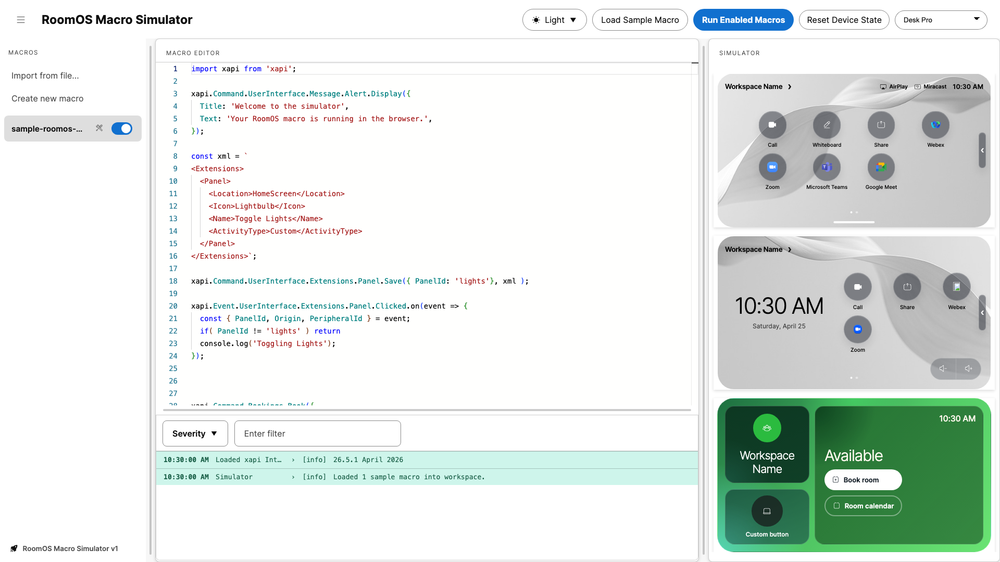
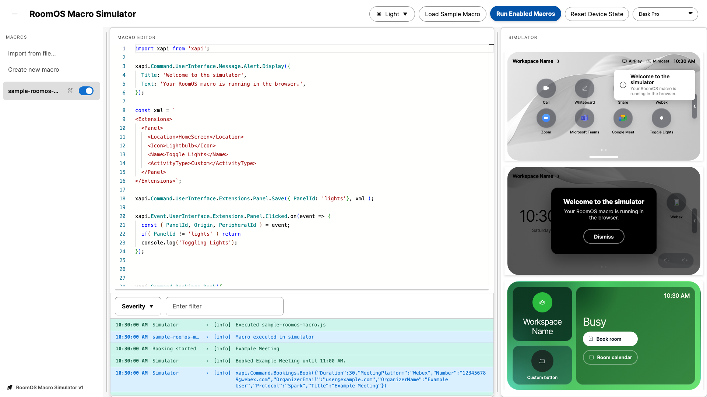

# RoomOS Macro Simulator

> <span style="color:#ff9f43;"><strong>Warning:</strong> This is a work-in-progress Proof of Concept and is still under active development.</span>

`RoomOS Macro Simulator` is a browser-based simulator for experimenting with RoomOS-style macros without needing physical Cisco devices. It provides a local macro editor, runtime log viewer, and simulated device surfaces for the on-screen display, controller UI, and room scheduler UI.

Before running the bundled sample macro:

<picture>
  <source media="(prefers-color-scheme: dark)" srcset="screenshots/readme-screenshot-before-dark.png">
  <source media="(prefers-color-scheme: light)" srcset="screenshots/readme-screenshot-before-light.png">
  
</picture>

After running the bundled sample macro:

<picture>
  <source media="(prefers-color-scheme: dark)" srcset="screenshots/readme-screenshot-after-dark.png">
  <source media="(prefers-color-scheme: light)" srcset="screenshots/readme-screenshot-after-light.png">
  
</picture>

## Overview

This project is a static web application powered by Vite and TypeScript modules. Macro files are loaded into the Monaco editor, executed in-browser against a simulated `xapi` facade, and then reflected into the UI renderers that model RoomOS device surfaces.

The simulator currently includes:
- a macro file list and editor
- an internal runtime log viewer
- simulated OSD, controller, and room scheduler surfaces
- sample macros for quick testing
- unit and end-to-end test coverage for key flows

## Live Demo

Check out the live demo here:

https://wxsd-sales.github.io/roomos-macro-simulator

*For more demos & PoCs like this, check out our [Webex Labs site](https://collabtoolbox.cisco.com/webex-labs).*

## Local Setup

### Requirements

- Node.js 18+ recommended
- npm

### Install

1. Clone the repository.

```bash
git clone https://github.com/wxsd-sales/roomos-macro-simulator.git
cd roomos-macro-simulator
```

2. Install dependencies.

```bash
npm install
```

3. Install Playwright browsers if you want to run the end-to-end tests.

```bash
npm run test:e2e:install
```

### Run Locally

Start the local development server:

```bash
npm run dev
```

Then open the local URL shown in the terminal.

## Build

To create a production build:

```bash
npm run build
```

The built static site will be written to `dist/`.

## Tests

Run unit tests:

```bash
npm test
```

Run end-to-end tests:

```bash
npm run test:e2e
```

## README Screenshot

Generate the screenshots used in this README:

```bash
npm run screenshot:readme
```

By default this starts a local Vite server and writes before and after screenshots for both light and dark themes:

- `screenshots/readme-screenshot-before-light.png`
- `screenshots/readme-screenshot-before-dark.png`
- `screenshots/readme-screenshot-after-light.png`
- `screenshots/readme-screenshot-after-dark.png`

The after screenshots run the bundled sample macro first, so the OSD toast and controller alert modal are visible.

Capture a single state and theme when needed:

```bash
npm run screenshot:readme -- --state after --theme dark --output screenshots/readme-screenshot-after-dark.png
```

CI can override the capture target, output path, state, and theme with `README_SCREENSHOT_URL`, `README_SCREENSHOT_OUTPUT`, `README_SCREENSHOT_STATE`, and `README_SCREENSHOT_THEME`. Use `{state}` and `{theme}` in the output path when capturing multiple variants; if omitted, the script appends the missing values before the file extension.

## License

All contents are licensed under the MIT license. Please see [license](LICENSE) for details.

## Disclaimer

Everything included is for demo and Proof of Concept purposes only. Use of the site is solely at your own risk. This site may contain links to third party content, which we do not warrant, endorse, or assume liability for. These demos are for Cisco Webex use cases, but are not official Cisco Webex branded demos.

## Questions

Please contact the WXSD team at [wxsd@external.cisco.com](mailto:wxsd@external.cisco.com?subject=roomos-macro-simulator) for questions. Or, if you're a Cisco internal employee, reach out to us on the Webex App via our bot (`globalexpert@webex.bot`). In the `Engagement Type` field, choose `API/SDK Proof of Concept Integration Development` to make sure you reach our team.
